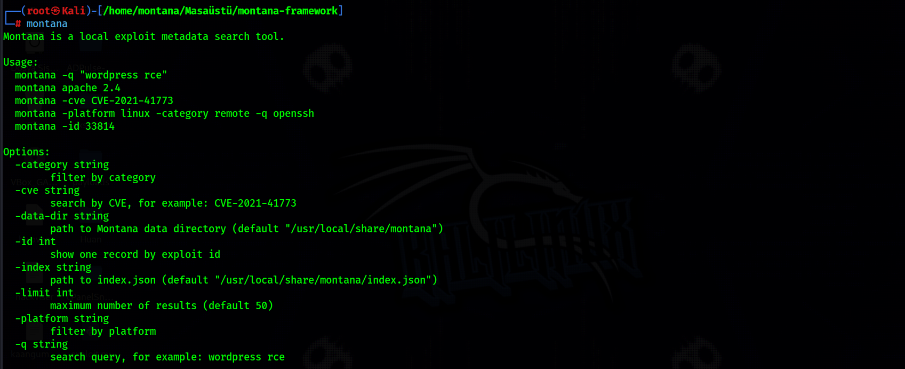

# Montana



Montana is a Kali/Linux-focused local exploit search tool inspired by `searchsploit`.

It searches exploit metadata from `index.json` and shows matching records with useful fields such as ID, title, CVE, platform, category, author, source link, and local archive path. The repository includes an offline `exploits/` archive, but the CLI does not execute exploit code, open shells, run scanners, or copy exploit files into the working directory.

## Purpose

Montana is designed for fast local lookup during authorized security research, lab work, patch verification, and defensive triage.

It is intentionally simple:

- Search exploit metadata
- Find records by keyword, CVE, platform, category, or ID
- Show the local archive path for a matching exploit
- Keep the exploit archive available offline

## What It Does Not Do

Montana is not an exploitation framework.

- It does not run exploits.
- It does not open an OS shell.
- It does not run Nmap or external scanners.
- It does not auto-select or recommend exploit execution.
- It does not copy/export exploit code through the CLI.

## Repository Contents

```text
main.go       CLI source code
index.json    Exploit metadata index
exploits/     Offline exploit text archive
install.sh    Kali/Linux installer
LICENSE       License file
```

Current archive size:

```text
index records: 39408
exploit files: 39408
```

## Installation

Requirements:

- Kali Linux or another Linux distribution
- Go 1.20+
- `sudo` for system-wide installation

Install:

```bash
git clone https://github.com/kaaangumus/montana-framework.git
cd montana-framework
chmod +x install.sh
sudo ./install.sh
```

The installer performs a full local installation:

```text
/usr/local/bin/montana
/usr/local/share/montana/index.json
/usr/local/share/montana/exploits/
```

## Build Without Installing

```bash
go build -o montana .
./montana -q "wordpress rce"
```

## Usage

Search by keyword:

```bash
montana -q "apache rce"
```

Search using plain arguments:

```bash
montana wordpress 5.2
```

Search by CVE:

```bash
montana -cve CVE-2021-41773
```

Filter by platform and category:

```bash
montana -platform linux -category remote -q openssh
```

Show a single record by exploit ID:

```bash
montana -id 36854
```

Example detail output:

```text
ID:       36854
Date:     10/06/2021
Title:    Apache HTTP Server 2.4.49 - Path Traversal Vulnerability
Platform: multiple
Category: web-applications
Author:   Lucas Souza
CVE:      CVE-2021-41773
Source:   https://0day.today/exploit/36854
Path:     /usr/local/share/montana/exploits/web-applications/36854.txt
```

Limit result count:

```bash
montana -q "wordpress" -limit 10
```

## Custom Paths

Use a custom metadata index:

```bash
montana -index /path/to/index.json -q nginx
```

Or set an environment variable:

```bash
export MONTANA_INDEX=/path/to/index.json
```

Use a custom Montana data directory for local archive paths:

```bash
export MONTANA_DATA=/path/to/montana-data
montana -id 36854
```

Expected custom data layout:

```text
/path/to/montana-data/index.json
/path/to/montana-data/exploits/
```

## Data Format

`index.json` contains an array of exploit metadata records:

```json
[
  {
    "exploit_id": 33814,
    "date": "01/01/2020",
    "category": "remote",
    "platform": "linux",
    "author": "researcher",
    "cve": ["CVE-0000-0000"],
    "title": "Example product remote issue",
    "original_link": "https://example.com/source"
  }
]
```

Montana maps records to local archive files using:

```text
exploits/<category>/<exploit_id>.txt
```

## Antivirus Notice

The `exploits/` directory contains proof-of-concept exploit text. Antivirus products, especially Windows Defender, may flag or quarantine files from the archive as HackTool, malware, or exploit content.

This is expected for offline exploit archives. Montana itself is only a search utility and does not execute exploit code.

## Legal Notice

Use Montana only for education, authorized security research, controlled labs, patch verification, and defensive analysis. Do not use the archive or metadata to attack systems without explicit permission.

## License

See [LICENSE](LICENSE).
